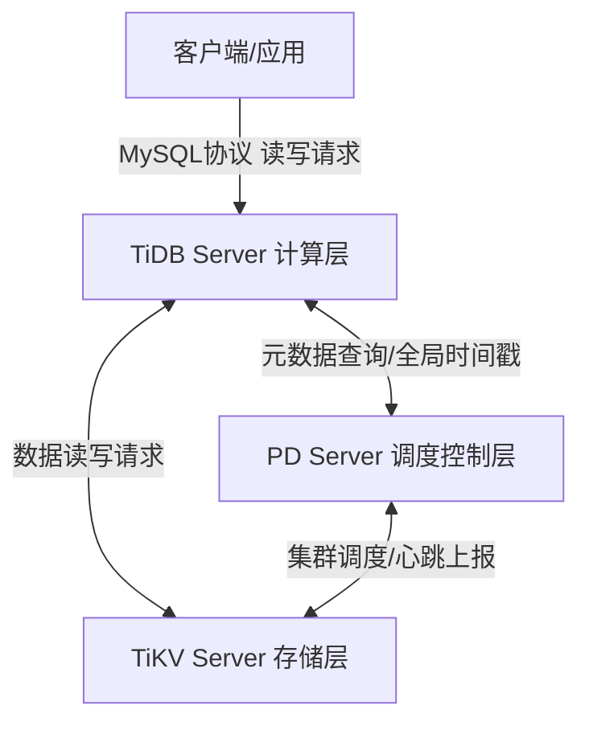
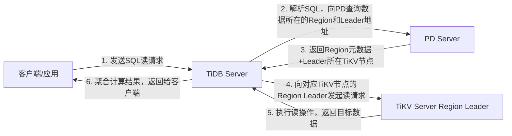
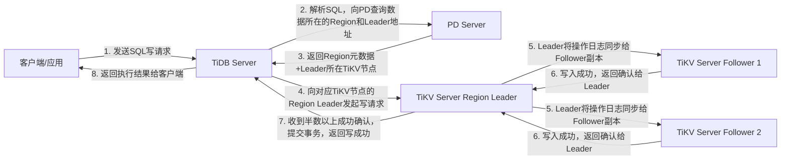

### 一句话核心定位
TiDB 是**兼容 MySQL 协议的分布式关系型数据库**，核心价值是：用单机 MySQL 几乎一致的开发使用体验（代码零修改、客户端直接连），解决传统单机数据库的性能/容量天花板、分库分表运维噩梦两大核心痛点，同时保证数据强一致、服务高可用、完整支持 ACID 分布式事务。

### 复盘使用建议
1.  先顺读完整逻辑链路，建立全局认知；
2.  重点抠「两大设计灵魂」「三层架构」「Region/Multi-Raft」核心模块，这是 TiDB 一切特性的根基；
3.  最后用末尾的「自检清单」验证掌握程度，能独立完成所有问题，即完全达标。

---

## 一、TiDB 两大核心设计灵魂（一切特性的根基）
这是你的老师明确强调的核心，所有架构设计均围绕这两个「分离」展开，复盘时必须先吃透设计理念，再理解架构落地。

| 核心理念 | 传统方案的痛点 | TiDB 的设计逻辑 | 带来的核心收益 |
| :--- | :--- | :--- | :--- |
| **计算与存储分离** | 传统数据库计算（SQL解析、逻辑处理）和存储（数据落地）绑定在同一台机器，扩容必须整机升级，资源利用率极低，扩展灵活性极差 | 把「负责SQL计算的计算层」和「负责数据存储的存储层」完全拆分，二者独立部署、独立扩缩容 | 读并发高了只加计算节点，存储不够了只加存储节点，互不影响，弹性拉满 |
| **存储与调度分离** | 传统分布式存储由存储节点自己管理数据分布，极易出现负载不均，扩容、故障修复需要人工手动迁移数据，运维成本极高 | 把「负责数据存储的存储层」和「负责数据管理/调度的控制层」完全拆分，专门有独立组件做集群的「大脑」，全自动化管理数据 | 数据分布、负载均衡、扩容迁移、故障修复全自动化，真正实现一键扩缩容，零人工干预 |

---

## 二、TiDB 三层核心架构 全拆解
TiDB 集群的完整架构，就是对两大设计理念的完美落地，三层各司其职，共同组成完整的分布式数据库体系。

### 架构总览

### 1. TiDB Server（计算层，客户端唯一入口）
- **核心定位**：无状态的SQL计算引擎，是客户端/应用唯一的访问入口，100%兼容MySQL协议。
- **核心功能**：
  1.  接收客户端的连接和SQL请求，完成权限校验、语法解析、SQL优化、执行计划生成；
  2.  向PD查询数据所在的位置（Region+Leader地址），向对应的TiKV节点发起数据读写请求；
  3.  对TiKV返回的数据进行聚合、计算，最终把结果返回给客户端。
- **核心特点**：**完全无状态，不存储任何业务数据**。可以无限水平扩展，新增节点只需接入负载均衡即可分流，秒级提升集群并发处理能力。
- **类比**：餐厅的前台接待+点餐收银台，只负责接待客人、下单、给后厨传菜，不存食材、不炒菜。

### 2. PD Server（Placement Driver，调度控制层，集群大脑）
- **核心定位**：集群的全局控制中枢，元数据管理+自动化调度核心，是两大分离理念中「存储与调度分离」的落地载体。
- **核心功能**：
  1.  **元数据管理**：维护集群的全局「数据地图」，精准记录每一份数据（Region）存在哪个TiKV节点、哪个节点是Leader；
  2.  **全局自动化调度**：负责集群的负载均衡、扩容数据迁移、故障副本补全、热点数据分散、Region分裂/合并；
  3.  **全局时钟分配**：为分布式事务分配全局唯一、递增的时间戳（TSO），保证分布式事务的顺序正确性和隔离性。
- **核心特点**：**高可用架构**，标准部署为3节点，通过Raft协议选主，只要超过半数节点存活，集群就可以正常工作，不会脑裂、不丢元数据。
- **类比**：餐厅的总经理+仓库管理员，知道所有食材的存放位置，负责调度后厨资源、平衡负载，保证整个餐厅高效运转。

### 3. TiKV Server（存储层，数据最终落地底座）
- **核心定位**：分布式键值（KV）存储引擎，是业务数据最终落地的地方，是两大分离理念中「计算与存储分离」的存储载体。
- **核心功能**：
  1.  以Region为最小单元存储业务数据，通过Multi-Raft协议维护每个Region的多副本强一致；
  2.  接收TiDB Server的读写请求，执行最终的数据落地和读取操作；
  3.  向PD上报节点状态、Region信息、负载情况，接受PD的调度指令。
- **核心特点**：**分布式有状态存储**，可以无限水平扩展，新增节点后PD会自动均衡数据，线性提升集群的存储容量和读写吞吐量。
- **类比**：餐厅的后厨冷库+灶台，负责存储食材、执行炒菜操作，是最终交付菜品的核心单元。

---

## 三、核心前置概念 必懂复盘重点
这部分是你之前的卡点，也是TiDB分布式能力的核心，复盘时必须100%吃透，锚定你已掌握的ZAB协议，零陌生感。

### 1. Raft 协议（分布式强一致核心）
- **核心定位**：和你学过的ZAB协议是亲兄弟，**核心目标、核心规则90%完全一致**，是用来保证分布式集群多副本数据强一致、服务高可用的一致性协议。
- **与ZAB 1:1对标（直接复用已有认知）**

  | ZAB协议 | Raft协议 | 完全一致的核心规则 |
  | :--- | :--- | :--- |
  | Leader主节点 | Leader主节点 | 组内唯一主节点，所有写请求必须走Leader，负责同步数据给从节点 |
  | Follower从节点 | Follower从节点 | 只同步Leader日志，不处理写请求，参与选举和多数派投票 |
  | 选举阶段 | Candidate候选人 | Leader挂了后，从节点进入选举状态，竞争新Leader |

- **必须死记的核心规则（老师明确要求）**
  1.  **多数派写入成功即成功**：写请求由Leader同步给Follower，只要超过半数的副本确认写入成功，本次写操作就算最终成功；
  2.  **过半存活即可用**：只要副本组内超过半数的节点存活，组就能正常提供服务，不会丢数据、不会脑裂；
  3.  **崩溃自动选主**：Leader挂了后，剩余节点秒级自动发起选举，只有获得半数以上选票、且拥有最全日志的节点，才能当选新Leader；
  4.  **日志顺序同步**：所有操作按顺序同步，保证所有副本的日志完全一致，最终数据状态必然一致。

### 2. Region（TiKV 最小核心单元）
- **本质定义**：TiKV不会把整张表的数据存在一个大文件里，而是**按照主键顺序，把数据切成一个个连续的、默认96MB大小的独立数据块，这个最小的「存储单元、调度单元、Raft副本单元」，就叫Region**。
- **为什么必须有Region（解决的核心痛点）**
  没有Region，整个TiKV集群只能用一个Raft组，和ZooKeeper一样，整个集群只有一个Leader处理写请求，性能有天花板，扩容、故障恢复成本极高，完全无法支撑TB/PB级数据和高并发场景。
  Region把整个大集群拆成了无数个迷你分布式集群，彻底解决了单Raft组的性能瓶颈。
- **核心规则**
  1.  每个Region默认3个副本，副本必须分布在不同的TiKV节点上，避免单节点故障丢数据；
  2.  Region是PD调度的最小单元，数据迁移、负载均衡均以Region为单位，96MB的小文件秒级完成迁移，业务无感知；
  3.  Region自动分裂：当数据量超过144MB（默认96MB的1.5倍），会自动分裂为两个大小相近的新Region，每个新Region都有独立的副本和Raft组，全程自动化。

### 3. Multi-Raft（多Raft组，TiKV分布式能力的核心）
- **本质定义**：**TiKV中，每一个Region的3个副本，都会组成一个完全独立、互不干扰的Raft一致性组，这个Raft组只负责同步当前Region的数据；整个集群有无数个这样的独立Raft组，这就是Multi-Raft**。
- **和单Raft组（ZAB）的核心区别**
  你熟悉的ZooKeeper是**单Raft/ZAB组**：整个集群只有一个Raft组，一个Leader，管全量数据；
  TiKV的Multi-Raft是**无数个迷你Raft/ZAB组**：每个Region对应一个独立的Raft组，每个组有自己的Leader，只管自己的Region数据，互不影响。
- **超形象类比（复盘快速唤醒记忆）**
  单Raft组：整个图书馆只有1个管理员，所有借书还书都必须找他，忙死也处理不过来；
  Multi-Raft+Region：图书馆把图书切成无数个96MB的小书架（Region），每个书架配一个独立的3人管理员小组（Raft组），每个小组有自己的组长（Leader），只负责这个书架的借还，整个图书馆有无数个并行工作的小组，处理能力随书架数量线性提升。
- **给TiDB带来的核心收益**
  1.  性能线性提升，无天花板：无数个Region Leader分布在不同节点，读写请求并行处理，加机器=加Leader=线性提升性能；
  2.  故障影响面极小：单节点挂了，只会影响该节点上的Region对应的Raft组，其余业务完全不受影响，秒级完成选主和副本补全；
  3.  完美负载均衡：PD可以把热点Region分散到不同节点，不会出现“一个节点忙死，其余节点闲死”的情况。

---

## 四、TiDB 三大核心特性 实现逻辑复盘
这部分是TiDB的核心能力，所有实现均基于上面的架构和核心概念，复盘时要做到「知其然，也知其所以然」。

### 1. 水平扩展：一键扩缩容，无限弹性
- **解决的痛点**：传统单机数据库的性能/容量天花板，分库分表手动扩容的巨大运维成本。
- **实现逻辑**
  - **计算层（TiDB Server）扩容**：TiDB是无状态的，直接新增节点启动，接入负载均衡即可自动分流，零数据迁移，秒级完成，瞬间提升集群并发能力。
  - **存储层（TiKV Server）扩容**：新增TiKV节点启动后，自动向PD注册；PD发现新节点后，自动将其他节点上的部分Region副本平滑迁移到新节点；迁移过程业务无感知，完成后新节点即可分担读写压力。
- **核心结论**：TiDB的水平扩展，本质是靠「无状态计算节点」+「PD自动化调度」+「Region最小调度单元」实现的，真正做到一键扩缩容，无需修改业务代码，无需手动迁移数据。

### 2. 强一致性与高可用：数据不丢，服务不停
- **解决的痛点**：分布式环境下，节点故障导致的数据丢失、数据不一致、服务中断。
- **实现逻辑**：基于Multi-Raft协议实现，每个Region的Raft组独立工作，靠Raft核心规则保证强一致和高可用。
  - **强一致保证**：所有写请求必须走Region Leader，只有超过半数副本写入成功，才算操作成功，保证所有副本的数据最终完全一致，不会出现读旧数据、数据错乱。
  - **高可用保证**：单TiKV节点挂了，只会影响该节点上的Region副本，对应的Raft组会秒级重新选主，PD会自动在其他节点补全缺失的副本；只要每个Region的Raft组有超过半数的副本存活，业务就完全不受影响，数据绝对不丢。
- **核心结论**：Multi-Raft给每一份数据都上了多副本保险，靠多数派规则保证数据强一致，靠自动选主保证服务高可用，实现了「RPO=0（零数据丢失），RTO<30s（秒级故障恢复）」的企业级高可用能力。

### 3. 分布式事务：ACID保证，对应用完全透明
- **解决的痛点**：传统分库分表方案下，跨库事务无法实现，业务需要自行处理分布式问题，开发成本极高。
- **核心结论（阶段要求，不深挖底层实现）**
  1.  **完全兼容MySQL语法**：业务代码中写`BEGIN/COMMIT/ROLLBACK`，和使用单机MySQL完全一致，无需关心底层数据分布在多少个TiKV节点上，对应用100%透明。
  2.  **严格支持ACID四大特性**：原子性（事务要么全成功要么全失败）、一致性（数据状态永远正确）、隔离性（支持MySQL标准隔离级别，并发事务互不干扰）、持久性（提交成功的数据永久不丢）。
  3.  **底层全封装**：分布式事务的复杂逻辑（全局时间戳、两阶段提交），TiDB已完全封装，业务层无需关注。

---

## 五、全链路读写流程 完整闭环（阶段核心产出）
这是你阶段达标的核心产出，复盘时必须能独立画出完整流程，把所有零散知识点串成闭环。

### 1. 读请求（SELECT）完整流程

### 2. 写请求（INSERT/UPDATE/DELETE）完整流程

---
