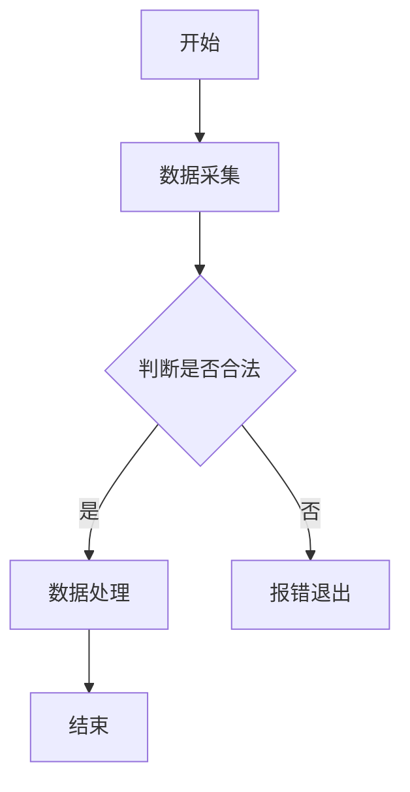
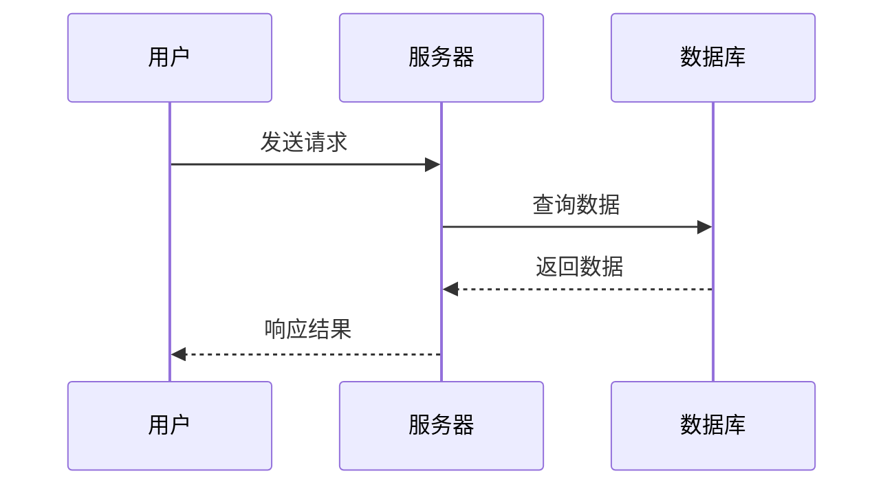

# Markdown 进阶玩法速查表
**适用场景**：笔记编写、文档撰写、博客发布、代码注释；**兼容说明**：标注「通用」为绝大多数解析器支持，「平台专属」为特定编辑器/平台支持，HTML标签为通用补充语法
可直接复制本文档到你的编辑器（Typora/Obsidian/VS Code），实时查看渲染效果

## 一、基础补漏（易忽略的原生核心语法）
原生Markdown基础语法的高频易混/易漏用法，优先使用原生语法保证兼容性
| 功能         | 语法示例                  | 渲染效果/说明                     |
|--------------|---------------------------|----------------------------------|
| 多级标题     | `## 二级标题`/`### 三级标题` | 最多支持6级，#后加空格才生效      |
| 无序列表嵌套 | `- 一级列表`<br>&nbsp;&nbsp;`- 二级列表` | 用**2个空格/制表符**实现嵌套      |
| 有序列表嵌套 | `1. 一级列表`<br>&nbsp;&nbsp;`1. 二级列表` | 嵌套层级序号可重复，渲染会自动排序 |
| 强制换行     | `第一行  `<br>`第二行`     | 行尾加**2个空格**，替代HTML<br>   |
| 行内代码     | ``int a = 0;``             | `int a = 0;` 适合短代码/关键词    |
| 分割线       | `---`/`***`                | 单独一行输入，上下空行更美观      |

## 二、高级格式（HTML补充+原生扩展，解决原生语法不足）
原生Markdown无专属语法的格式效果，用HTML标签实现**全平台通用**，是最推荐的补充方式
| 功能         | 语法示例                  | 渲染效果/说明                     |
|--------------|---------------------------|----------------------------------|
| 下划线       | `<u>需要下划线的内容</u>`  | <u>需要下划线的内容</u>           |
| 上标         | `H<sub>2</sub>O`           | H<sub>2</sub>O（化学式/下标）     |
| 下标         | `2<sup>3</sup>=8`          | 2<sup>3</sup>=8（次方/上标）      |
| 删除线       | `~~删除的内容~~`（原生）/`<strike>删除</strike>` | ~~删除的内容~~（原生更推荐）|
| 文字居中     | `<center>居中文字</center>` | <center>居中文字</center>         |
| 隐藏注释     | `<!-- 注释内容 -->`        | 渲染后完全隐藏，仅编辑页可见      |
| 任务清单     | `- [x] 已完成`<br>`- [ ] 未完成` | ✅ [x] 已完成<br>⬜ [ ] 未完成（通用） |
| 可折叠块     | `<details>`<br>`<summary>点击展开</summary>`<br>`隐藏的内容`<br>`</details>` | <details><summary>点击展开</summary>隐藏的内容</details>（通用，长文档必备） |

## 三、数学公式（LaTeX语法，理工科/数据分析必备）
主流编辑器（Typora/Obsidian/VS Code）、平台（CSDN/知乎）均支持，用`$`包裹实现，适合公式/符号排版
| 类型         | 语法示例                  | 渲染效果/说明                     |
|--------------|---------------------------|----------------------------------|
| 行内公式     | `$E=mc^2$`                | $E=mc^2$（嵌入正文，不换行）      |
| 块级公式     | `$$\sum_{i=1}^n i = \frac{n(n+1)}{2}$$` | $$\sum_{i=1}^n i = \frac{n(n+1)}{2}$$（单独成块，居中） |
| 常用符号     | `$\alpha$`/`$\pi$`/`$\geq$` | $\alpha$（阿尔法）、$\pi$（圆周率）、$\geq$（大于等于） |

## 四、图表绘制（Mermaid语法，免图床直接画）
**无需截图/插图片**，用纯文本绘制流程图/时序图/思维导图，Typora/Obsidian/GitHub 原生支持，适合技术文档
### 1. 流程图（最常用）
```markdown
```mermaid
graph TD  # TD=从上到下，LR=从左到右
A[开始] --> B[数据采集]
B --> C{判断是否合法}
C -->|是| D[数据处理]
C -->|否| E[报错退出]
D --> F[结束]
```
```
**渲染效果**：


### 2. 时序图（接口/交互说明）
```markdown

```

## 五、交互导航（长文档必备，实现文档内跳转/引用）
解决长文档翻找麻烦的问题，提升阅读体验，全平台通用
| 功能         | 语法示例                  | 说明                     |
|--------------|---------------------------|--------------------------|
| 锚点跳转     | `[跳转到「数学公式」](#三、数学公式)` | 跳转到文档内指定标题，**标题需小写**，空格用`-`替代（如「高级格式」→`#高级格式`） |
| 脚注引用     | `这是带脚注的句子[^1]`<br>`[^1]: 这里是脚注的详细说明` | 正文标`[^数字]`，文末统一写说明，点击脚注可跳转 |
| 外部链接     | `[GitHub](https://github.com/ "可选的鼠标悬停文字")` | 链接标题可省略，格式：`[显示文字](链接地址)` |

## 六、代码块进阶（程序员专属，提升代码可读性）
原生代码块的扩展用法，支持语言高亮、行号、折叠，适合贴代码/脚本
| 功能         | 语法示例                  | 说明                     |
|--------------|---------------------------|--------------------------|
| 语言高亮     | ```python<br>def hello():<br>&nbsp;&nbsp;print("Hello")<br>``` | 指定语言（python/java/c/sql），解析器自动高亮关键字 |
| 显示行号     | ```python linenums="1"<br>代码内容<br>``` | VS Code/Typora支持，`linenums="1"`表示从1开始编号 |
| 代码块折叠   | ```python fold="1"<br>超长代码内容<br>``` | Typora支持，`fold="1"`默认折叠，点击展开 |

## 七、平台专属扩展（各平台黑科技，按需使用）
不同Markdown平台/编辑器的独有扩展语法，针对性提升体验，**仅对应平台生效**
### 1. GitHub（代码仓库/博客）
- Emoji表情：`:smile:`/`:star:`/`:warning:` → 😄/⭐/⚠️（[GitHub Emoji大全](https://github.com/ikatyang/emoji-cheat-sheet)）
- 表格对齐：`| 左对齐 | 居中对齐 | 右对齐 |`<br>`|:--- |:---: |---: |`（`:---`左，`:---: `中，`---:`右）
- 代码块行高亮：```python<br># highlight-next-line<br>print("高亮这行")<br>```

### 2. Obsidian（笔记管理）
- 内部链接：`[[笔记文件名]]` → 跳转到本地其他笔记，双向链接自动生成
- 标签：`#数据库/#Python` → 给笔记打标签，支持标签筛选
- 画布嵌入：`![[画布名.canvas]]` → 嵌入Obsidian画布，实现图文混排

### 3. Typora（可视化编辑）
- 快捷键一键格式：`Ctrl+U`（下划线）/`Ctrl+Shift+M`（公式块）/`Ctrl+T`（表格）
- 图片缩放：`` → 自定义图片宽高
- 目录自动生成：`[TOC]` → 一键生成文档目录，随标题自动更新

## 八、核心使用原则（避坑必备）
1. **兼容性优先**：能用法原生Markdown的不用HTML，能不用平台专属的就不用，保证文档可移植；
2. **简洁性原则**：仅在需要复杂格式/功能时使用进阶技巧，避免过度排版；
3. **编辑器适配**：新技巧先在自己的编辑器测试，不同解析器对HTML/Mermaid的支持略有差异。
