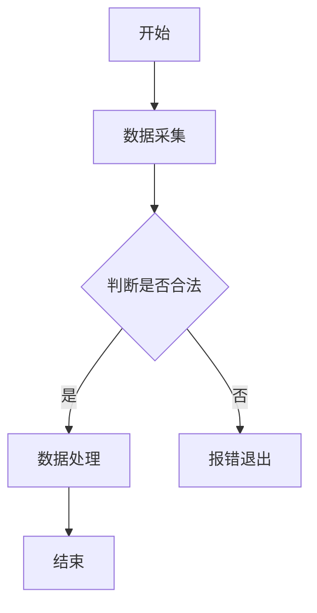
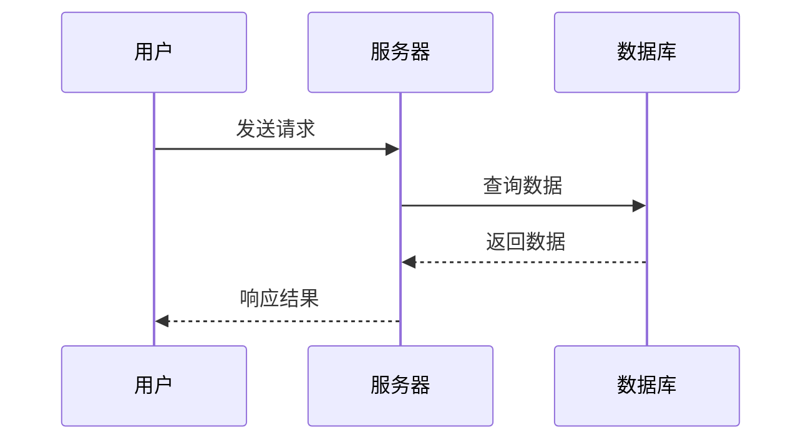

# Markdown 进阶玩法速查表（Demo 版）
## 说明
每个 Demo 独立封装「功能+语法示例+核心说明」，可直接复制示例到编辑器使用，快速查阅/复用。

---

### Demo 1：多级标题
**功能**：设置1-6级标题，区分文档层级
**语法示例**：
```markdown
# 一级标题
## 二级标题
### 三级标题
#### 四级标题
##### 五级标题
###### 六级标题
```
**核心说明**：`#` 后必须加空格才生效，优先用2-4级标题保证可读性。

### Demo 2：列表嵌套（无序/有序）
**功能**：实现列表多层级嵌套，梳理层级关系
**语法示例**：
```markdown
# 无序列表嵌套
- 一级列表
  - 二级列表
    - 三级列表

# 有序列表嵌套
1. 一级列表
  1. 二级列表
    1. 三级列表
```
**核心说明**：嵌套层级用「2个空格/制表符」分隔，有序列表嵌套序号可重复，渲染后自动排序。

### Demo 3：强制换行
**功能**：实现文本强制换行（替代HTML `<br>`）
**语法示例**：
```markdown
第一行文字（行尾加2个空格）  
第二行文字
```
**核心说明**：行尾必须加「2个空格」，否则会合并为一行。

### Demo 4：行内代码
**功能**：标注短代码/关键词，区分普通文本
**语法示例**：
```markdown
变量定义：`int a = 0;`，函数调用：`hello()`
```
**核心说明**：用反引号 `` ` `` 包裹，适合单行短代码/技术术语。

### Demo 5：分割线
**功能**：分隔文档区块，提升可读性
**语法示例**：
```markdown
---
***
```
**核心说明**：单独一行输入，上下空行渲染效果更美观，`---`/`***` 均通用。

---

### Demo 6：下划线/上标/下标
**功能**：实现文字特殊排版（全平台通用）
**语法示例**：
```markdown
<u>下划线内容</u>
H<sub>2</sub>O （下标）
2<sup>3</sup>=8 （上标）
```
**核心说明**：依赖HTML标签，所有Markdown解析器均支持。

### Demo 7：删除线
**功能**：标注需删除/作废的内容
**语法示例**：
```markdown
~~原生删除线（推荐）~~
<strike>HTML删除线</strike>
```
**核心说明**：优先用原生语法 `~~内容~~`，兼容性更好。

### Demo 8：文字居中
**功能**：实现文字居中显示
**语法示例**：
```markdown
<center>这是居中的文字</center>
```
**核心说明**：HTML标签实现，全平台通用。

### Demo 9：隐藏注释
**功能**：添加仅编辑页可见的备注/草稿
**语法示例**：
```markdown
<!-- 这是隐藏注释，渲染后不显示 -->
```
**核心说明**：注释内容不会出现在渲染后的页面，适合写思路/待办。

### Demo 10：任务清单
**功能**：制作可勾选的任务列表
**语法示例**：
```markdown
- [x] 已完成任务
- [ ] 未完成任务
```
**核心说明**：`[x]` 标记已完成，`[ ]` 标记未完成，通用语法，多平台支持。

### Demo 11：可折叠块
**功能**：隐藏长内容，点击展开（长文档必备）
**语法示例**：
```markdown
<details>
<summary>点击展开查看详情</summary>
这里是隐藏的内容，可放大段文字/代码/表格
</details>
```
**核心说明**：HTML标签实现，全平台通用，适合封装非核心内容。

---

### Demo 12：行内数学公式
**功能**：嵌入正文的短公式/符号（LaTeX语法）
**语法示例**：
```markdown
质能方程：$E=mc^2$，圆周率：$\pi≈3.14159$
```
**核心说明**：用单个 `$` 包裹，嵌入正文不换行，支持所有LaTeX基础符号。

### Demo 13：块级数学公式
**功能**：单独成块的复杂公式，居中显示
**语法示例**：
```markdown
$$
\sum_{i=1}^n i = \frac{n(n+1)}{2}
$$
```
**核心说明**：用两个 `$$` 包裹，自动居中，适合复杂公式/求和/积分等。

---

### Demo 14：流程图（Mermaid）
**功能**：纯文本绘制流程图，免图床
**语法示例**：
```markdown

```
**核心说明**：Typora/Obsidian/GitHub 原生支持，`graph TD/LR` 控制方向(TD=从上到下，LR=从左到右)。

### Demo 15：时序图（Mermaid）
**功能**：绘制接口/交互时序图
**语法示例**：
```markdown

```
**核心说明**：`->>` 表示主动消息，`-->>` 表示被动消息。

---

### Demo 16：锚点跳转
**功能**：跳转到文档内指定标题，长文档导航
**语法示例**：
```markdown
[跳转到「流程图」](#demo-14：流程图（mermaid）)
```
**核心说明**：标题需小写，空格替换为 `-`，锚点值与目标标题一致（含特殊符号）。

### Demo 17：脚注引用
**功能**：添加文本引用说明，学术/长文档必备
**语法示例**：
```markdown
这是带脚注的句子[^1]
[^1]: 这里是脚注的详细说明，可放文末
```
**核心说明**：`[^数字]` 标记引用，文末统一写说明，点击可跳转。

### Demo 18：外部链接
**功能**：添加跳转至外部网页的链接
**语法示例**：
```markdown
[GitHub](https://github.com/ "鼠标悬停提示文字")
```
**核心说明**：`[显示文字](链接地址 "可选提示")`，提示文字可省略。

---

### Demo 19：代码块语言高亮
**功能**：代码语法高亮，提升可读性
**语法示例**：
```markdown
```python
def hello():
    print("Hello Markdown")
```
```
**核心说明**：代码块开头指定语言（python/java/c/sql），解析器自动高亮关键字。

---

### Demo 21：GitHub 专属 - 表格对齐
**功能**：实现表格内容左/中/右对齐
**语法示例**：
```markdown
| 左对齐 | 居中对齐 | 右对齐 |
|:--- |:---: |---: |
| 内容1 | 内容2 | 内容3 |
```
**核心说明**：`:---` 左对齐，`:---: ` 居中，`---:` 右对齐。

### Demo 22：GitHub 专属 - Emoji 表情
**功能**：添加表情符号，提升文档趣味性
**语法示例**：
```markdown
✅ 完成：:smile: 开心 | ⚠️ 警告：:warning:
```
**核心说明**：`:表情关键词:` 格式，可查「GitHub Emoji 大全」获取关键词。

